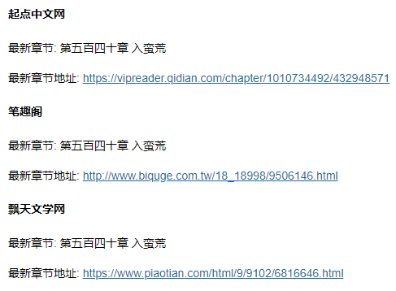

## novels

novels 是一个小说/影视更新通知程序, 通知方式: 邮件、微信, 推荐使用邮件方式，配置简单，微信通知要复杂一些.

支持Linux标准的crontab表达式周期性的检查

每天7-22点，每5分钟检查一次，默认是每隔5分钟检查一次  */5 * * * *

例如:

```sh
*/5 7-22 * * *
```

每周五的7-22点，每10分钟检查一次
```sh
*/10 7-22 * * 5
```


## 通知效果

#### 邮件标题


#### 小说通知效果 提供最新的章节链接



#### 动漫通知效果 提供的下载地址


## 下载安装

直接 [下载](https://github.com/chanyipiaomiao/novels/releases) 二进制包运行

## 使用步骤

1. 如果使用邮件报警,推荐使用 [SendCloud](https://sendcloud.sohu.com/) 进行邮件通知, 每天可以免费50封邮件，足够使用

2. 注册之后拿到 api_user 和 api_key, 到 conf/app.conf 中配置

```go
[email]
# 发送邮件方式 sendcloud | selfhost
type = sendcloud

# 收件人
to = xxxxx@163.com

[email_sendcloud]
# sendcloud服务

# from 邮件地址
from = xxxxx@xxxxxx.com

# fromName
fromName = 更新通知xxxxx@xxxxxx.com
api_user = xxxxxxxxxxxx
api_key = xxxxxxxxxxxx
api_url = http://api.sendcloud.net/apiv2/mail/send
```

3.使用帮助

```go
D:\workspace\Go\src\novels>novels --help
usage: novels [<flags>] <command> [<args> ...]

novels is a novel update notice program

Flags:
  --help  Show context-sensitive help (also try --help-long and --help-man).

Commands:
  help [<command>...]
    Show help.

  novel --action=ACTION [<flags>]
    novel增删改查

  parser [<flags>]
    解析器

  cron --expr=EXPR
    cron表达式

```


4.查看支持解析的网站

只能添加属于下面网站的小说/影视

```bash
novels git:(master) ./novels parser
解析器: book.qidian.com 网站名称: 起点中文网
解析器: www.biquge.com.tw 网站名称: 笔趣阁
解析器: www.80s.tw 网站名称: 80s手机电影
解析器: www.piaotian.com 网站名称: 飘天文学网
解析器: www.zwdu.com 网站名称: 八一中文网
```

5.添加

```bash
./novels help novel
usage: novels novel --action=ACTION [<flags>]

novel增删改查

Flags:
      --help                Show context-sensitive help (also try --help-long and --help-man).
  -a, --action=ACTION       action: update | delete | run | debug
  -n, --name=NAME           小说/影视名称
  -u, --tableURL=TABLEURL   小说/影视目录URL
  -s, --sitename=SITENAME   网站的名称
  -c, --cron="*/5 * * * *"  设置计划任务,默认是每隔5分钟,支持Linux标准的cron表达式

```

比如添加以下小说: 
```bash
./novels novel -a update -n "凡人修仙之仙界篇" -u https://book.qidian.com/info/1010734492#Catalog -s "起点中文网" -c "*/5 7-22 * * *"
```
```bash
./novels novel -a update -n "凡人修仙之仙界篇" -u https://www.piaotian.com/html/9/9102/index.html -s "飘天文学网"  -c "*/5 7-22 * * *"
```
一个小说可以添加多个站点

添加动漫

比如 每周五更新的 星辰变动漫

```bash
./novels novel -a update -n "星辰变动漫"  -u  https://www.80s.tw/dm/23508 -s "80s手机电影网"  -c "*/10 7-22 * * 5"
```

6.删除

删除某个小说

```bash
./novels novel -a delete -n "凡人修仙之仙界篇"
```

删除某个小说的某个站点

```bash
./novels novel -a delete -n "凡人修仙之仙界篇" -u "https://book.qidian.com/info/1010734492#Catalog"
```

7.调试输出

```bash
./novels novel -a debug
```

```bash
名称: 凡人修仙之仙界篇 计划任务: */5 7-22 * * *

	起点中文网
    	========
        解析器: book.qidian.com
        目录URL: https://book.qidian.com/info/1010734492#Catalog
        前一个章节: 第五百三十九章 沙海异兽
        最新章节: 第五百四十章 入蛮荒
        最新章节URL: https://vipreader.qidian.com/chapter/1010734492/432948571
```

可以查看详细信息

8.运行

```bash
./novels novel -a run
```

9.检查cron表达式是否正确

```bash
➜  novels git:(master) ✗ ./novels cron --expr="*/5 7-22 * * *"
解析正确, 下次运行时间: 2018-11-08 10:05:00 +0800 CST
➜  novels git:(master) ✗ ./novels cron --expr="*/5 7-22 * * 5"
解析正确, 下次运行时间: 2018-11-09 07:00:00 +0800 CST
➜  novels git:(master) ✗ 

```

10.修改某个小说的计划任务

再次添加一次，后面跟新的计划任务即可

```bash
./novels novel -a update -n "凡人修仙之仙界篇" -u https://book.qidian.com/info/1010734492#Catalog -s "起点中文网" -c "*/10 7-22 * * *"
```